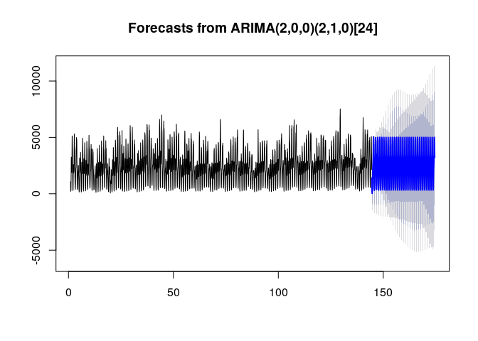

# Project Overview

## Situation
The demand for ride-sharing is drastically increasing, especially in large cities. Uber is the first ride-sharing company and has operations in over 900 metropolitan areas worldwide. As rapidly growing demand and shortage of the vehicle, surge pricing for the rides is concerned these days. It is difficult to forecast the demand with various factors such as weather or public events.

## Action and Goal
Time-series data for the Uber trip (January - June 2015) was used for exploratory data analysis, visualisation and forecasting model to test the hypothesis. All analysis was implemented on R and R Markdown and a forecasting model was developed using a traditional statistical model, Seasonal Autoregressive Integrated Moving Average (SARIMA) and Linear Regression model. The accuracy of the prediction was measured by MAPE (Mean Absolute Percentage Error).

# Loading

## Loading libraries
All loaded libraries for this analysis are shown below.


```
##  [1] "MLmetrics"   "here"        "tseries"     "plotly"      "forecast"   
##  [6] "fastDummies" "caret"       "lattice"     "patchwork"   "gridExtra"  
## [11] "data.table"  "forcats"     "purrr"       "tidyr"       "tibble"     
## [16] "ggplot2"     "tidyverse"   "stringr"     "dplyr"       "readr"      
## [21] "stats"       "graphics"    "grDevices"   "utils"       "datasets"   
## [26] "methods"     "base"
```

# Import data
All data used in this project is stored in "data" directory. Uber trip data from 2015 (January - June): with less fine-grained location information. This data contains 14.3 million more Uber pickups from January to June 2015.

- uber-raw-data-janjune-15.csv.zip

**(Data Source)**  
The data shown above can be obtained from:  
Uber trip data: https://github.com/fivethirtyeight/uber-tlc-foil-response


# Visualisation

## Number of rides by borough

<!-- -->
Manhattan has the most populous county followed by Brooklyn and Queens.

## Number of rides by day of week

<!-- --><!-- -->

# Modelling

The Uber rides in Manhattan that is the most popular area are used for builing model and examine prediction results.
## Preprocessing for modelling


## Stationarity of the data
To check the stationarity of a time series, a statistica test, **Augmented Dickey-Fuller (ADF) test**, is used. The hypothesesis of the ADF test:  
**Null Hypothesis**: The time series displays a unit-root, which means the time series is non-stationary.  
**Alternative Hypothesis**: There is no unit-root in the time series, meaning the time series is stationary.
<!-- -->

```
## 
## 	Augmented Dickey-Fuller Test
## 
## data:  manhattan.ts
## Dickey-Fuller = -16.099, Lag order = 15, p-value = 0.01
## alternative hypothesis: stationary
```
The result of the ADF test shows p-value = 0.01 < 0.05, meaning the null hypothesis was rejected. So the time series data of the Uber rides in Mahnattan is concluded as **statinary**.

## SARIMA (Seasonal Auto Regressive Integrated Moving Average)

```
## 
##  Fitting models using approximations to speed things up...
## 
##  ARIMA(2,0,2)(1,1,1)[24] with drift         : Inf
##  ARIMA(0,0,0)(0,1,0)[24] with drift         : 56112.97
##  ARIMA(1,0,0)(1,1,0)[24] with drift         : 50338.74
##  ARIMA(0,0,1)(0,1,1)[24] with drift         : Inf
##  ARIMA(0,0,0)(0,1,0)[24]                    : 56110.98
##  ARIMA(1,0,0)(0,1,0)[24] with drift         : 50420.77
##  ARIMA(1,0,0)(2,1,0)[24] with drift         : 50110.16
##  ARIMA(1,0,0)(2,1,1)[24] with drift         : Inf
##  ARIMA(1,0,0)(1,1,1)[24] with drift         : Inf
##  ARIMA(0,0,0)(2,1,0)[24] with drift         : 55868.73
##  ARIMA(2,0,0)(2,1,0)[24] with drift         : 49261.39
##  ARIMA(2,0,0)(1,1,0)[24] with drift         : 49444.13
##  ARIMA(2,0,0)(2,1,1)[24] with drift         : Inf
##  ARIMA(2,0,0)(1,1,1)[24] with drift         : Inf
##  ARIMA(3,0,0)(2,1,0)[24] with drift         : 49263.21
##  ARIMA(2,0,1)(2,1,0)[24] with drift         : 49261.81
##  ARIMA(1,0,1)(2,1,0)[24] with drift         : 49407.85
##  ARIMA(3,0,1)(2,1,0)[24] with drift         : 49262.25
##  ARIMA(2,0,0)(2,1,0)[24]                    : 49259.38
##  ARIMA(2,0,0)(1,1,0)[24]                    : 49442.12
##  ARIMA(2,0,0)(2,1,1)[24]                    : Inf
##  ARIMA(2,0,0)(1,1,1)[24]                    : Inf
##  ARIMA(1,0,0)(2,1,0)[24]                    : 50108.14
##  ARIMA(3,0,0)(2,1,0)[24]                    : 49261.19
##  ARIMA(2,0,1)(2,1,0)[24]                    : 49259.8
##  ARIMA(1,0,1)(2,1,0)[24]                    : 49405.83
##  ARIMA(3,0,1)(2,1,0)[24]                    : 49260.22
## 
##  Now re-fitting the best model(s) without approximations...
## 
##  ARIMA(2,0,0)(2,1,0)[24]                    : 49597.77
## 
##  Best model: ARIMA(2,0,0)(2,1,0)[24]
```


```r
manhattan.pred.arima <-forecast(manhattan.arima, h=720)
plot(forecast(manhattan.arima,range=c(50,95),h=720))
```

<!-- -->


```r
mape_arima <- MAPE(manhattan.pred.arima[["mean"]], uber.Manhattan.test$Manhattan) * 100
print(paste("MAPE (SARIMA Model):", round(mape_arima,3), "%"))
```

```
## [1] "MAPE (SARIMA Model): 31.314 %"
```

## Linear Model


```r
# ** Linear model ####

# Base model
lm0 <- lm(Manhattan ~ Weekday + Hour,
          data = uber.Manhattan.train)

# Add lag features
lm1 <- update(lm0, ~ . + `1h` + `2h` + `3h` + `1d` + `1w`)
pred1 <- predict(lm1, newdata = uber.Manhattan.test)

# MAPE
mape_lm <- MAPE(pred1, uber.Manhattan.test$Manhattan) * 100
print(paste("MAPE (Linear Model):", round(mape_lm, 3), "%"))
```

```
## [1] "MAPE (Linear Model): 12.253 %"
```

# Deployment


<!-- --><!-- -->

